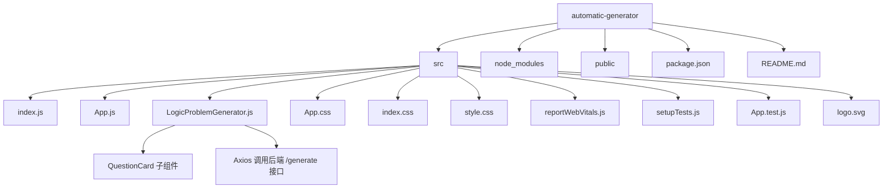

## 离散数学逻辑等式作业生成系统  
## Discrete Math Logic Homework Generator

### 项目简介 Project Overview

离散数学逻辑等式作业生成系统是一个基于学号生成个性化逻辑练习题的 Web 应用，用于辅助高校教学并降低作业抄袭风险。  

This project is a web-based generator for personalized logic exercises in university discrete mathematics courses. It uses student IDs to deterministically generate unique problem sets, helping instructors reduce cheating by copying homework.

---

## 技术栈与架构 Tech Stack & Architecture

- **前端技术栈 Frontend**  
  - React (基于 Create React App)  
  - Axios（与后端逻辑生成服务交互）  
  - 自定义 CSS 样式（`style.css`, `App.css`）

- **依赖 Dependencies（节选）**  
  - `react`, `react-dom`, `react-scripts`  
  - `axios`  
  - `@testing-library/react` 系列（测试相关）  
  - `web-vitals`

- **架构概览 Architecture Overview**  
  - 前端 React 应用运行在浏览器中，主要页面组件为 `LogicProblemGenerator`。  
  - 前端通过 `axios.post` 调用远程逻辑生成服务 `https://logicgen.onrender.com/generate`。  
  - 教师模式用于配置生成参数；学生模式仅输入学号，即可获取根据学号唯一确定的题目集合。  

---

## 项目结构 Project Structure



---

## 安装指南 Installation Guide

### 环境要求 Prerequisites

- **Node.js**: 建议使用 Node 18+  
- **npm 或 yarn**: 推荐使用 npm（Create React App 默认）

### 克隆与依赖安装 Clone & Install

```bash
# 克隆仓库
git clone <your-repo-url> automatic-generator
cd automatic-generator

# 安装依赖
npm install
# 或者
yarn install
```

### 开发环境启动 Run in Development

```bash
npm start
# 或 yarn start
```

- 启动后访问 `http://localhost:3000`  
- 源码修改会自动热更新（HMR）

### 生产构建 Build for Production

```bash
npm run build
# 或 yarn build
```

- 编译结果输出到 `build/` 目录，可部署到任意静态服务器。

### 后端服务配置 Backend Service Configuration

当前前端默认调用的后端地址为：  

```javascript
// src/LogicProblemGenerator.js 中节选
const response = await axios.post('https://logicgen.onrender.com/generate', payload);
```

如需更换后端地址（自建或私有部署），建议：

1. 在项目根目录创建 `.env` 文件，例如：  

   ```bash
   REACT_APP_LOGIC_API_BASE=https://your-backend.example.com
   ```

2. 修改 `src/LogicProblemGenerator.js` 使用环境变量：  

   ```javascript
   const API_BASE = process.env.REACT_APP_LOGIC_API_BASE || 'https://logicgen.onrender.com';

   const response = await axios.post(`${API_BASE}/generate`, payload);
   ```

3. 重新启动前端：`npm start`

---

## 使用说明 Usage Guide

### 模式切换：学生 / 老师 Student / Teacher Mode

在页面右上角有一个模式选择下拉框：  

- **学生模式 student**（默认）  
  - 输入：学号  
  - 操作：点击“生成题目”  
  - 输出：根据学号个性化生成的一组逻辑题目卡片，每个卡片附带若干逻辑推理规则作为提示。  

- **老师模式 teacher**  
  - 输入：
    - `Secret Key`：教师私密密钥（只在教师与后端之间共享）  
    - `题目数量 question_num`：要生成的题目个数  
    - `最少使用规则数 rule_num`：每道题至少涉及的逻辑规则数量（影响题目复杂度）  
  - 操作：点击“保存参数”  
  - 输出：后端返回“参数更新成功”等提示信息，用于确认参数已被后端接受。  

### 学生模式详细流程 Student Workflow

1. 在模式选择中保持 **学生 student**。  
2. 在输入框中填写**学号**（建议使用完整学号，保持稳定性和唯一性）。  
3. 点击 **“生成题目”** 按钮。  
4. 页面下方出现题目卡片区域，每张卡片包括：
   - **题干 question**：逻辑等式、推理或证明任务。  
   - **Hint 1 / Hint 2 / Hint 3**：分级展开的提示信息。  

### 教师模式详细流程 Teacher Workflow

1. 在模式选择中切换为 **老师 teacher**。  
2. 填写以下字段：
   - **Secret Key**：教师专用密钥，用于保证学号到题目的映射不可被学生猜测或伪造。  
   - **题目数量 question_num**：下拉框选择题目总数（当前 UI 支持 2–7）。  
   - **最少使用规则数 rule_num**：下拉框选择每题至少涉及的逻辑规则数量（当前 UI 支持 2–5）。  
3. 点击 **“保存参数”**，若成功，页面会显示“参数更新成功”或后端返回的消息。  
4. 之后学生使用学号生成的题目都会基于教师设置的最新参数。  

---

## 参数配置说明 Configurable Parameters

> 说明：当前前端 UI 主要暴露了 `question_num` 与 `rule_num` 两个参数。  
> 难度等级与题目类型通常在后端逻辑和题库中扩展实现，可通过 API 或后端配置控制。  
> 下表给出**推荐的参数设计**，便于二次开发或扩展后端时参考。

### 参数一览表 Parameter Table

| 参数名 / Name        | 类型 / Type     | 取值范围 / Range          | 默认值 / Default | 说明 / Description                                                                 |
|----------------------|-----------------|---------------------------|------------------|------------------------------------------------------------------------------------|
| `difficulty_level`   | number (int)    | 1 – 5                     | 3                | 题目整体难度：1 为基础练习，5 为高难证明与综合推理。前端可在教师模式中扩展该选项。      |
| `question_num`       | number (int)    | 10 – 100（推荐范围）      | 20               | 每份作业的题目数量。当前 UI 示例中为 2–7，可在后端与前端同步扩展到更大范围。          |
| `rule_num`           | number (int)    | 2 – 10                    | 3                | 每道题至少使用的逻辑规则数，越大题目推理链越长、复杂度越高。                         |
| `problem_types`      | array<string>   | 等式证明 / 真值表 / 逻辑推理 | `["等式证明"]`   | 控制生成题目的类型组合，可用于平衡证明题、真值表题和推理题的比例。                  |
| `secret_key`         | string          | 任意非空字符串            | 必填（教师端）   | 教师私密密钥，不向学生公开，用于与学号一起确定随机种子。                             |
| `student_id`         | string          | 学号（通常为数字串）       | 必填（学生端）   | 学生唯一标识，用于生成个性化题目。                                                 |

---

## 学号生成机制说明 Student ID Based Generation

> 核心目标：**同一学生在同一课程设置下，每次生成的题目应一致；不同学生的题目要显著不同；学生难以通过猜测他人学号来获取相同题目。**  

虽然具体实现逻辑位于后端服务中（当前前端通过 `axios.post('https://logicgen.onrender.com/generate', payload)` 调用），但典型的学号生成机制可以描述为以下步骤：

1. **组合信息生成种子 Seed Generation**  
   - 将 `student_id` 与教师配置的 `secret_key`、课程或作业编号（如 `assignment_id`）拼接，例如：  
     \[
     \text{seed\_input} = \text{student\_id} \,\|\, \text{secret\_key} \,\|\, \text{assignment\_id}
     \]
   - 对 `seed_input` 做哈希运算（如 SHA-256），得到稳定的、不可逆的随机种子值 `seed`。  

2. **初始化伪随机数生成器 PRNG Initialization**  
   - 使用 `seed` 初始化伪随机数生成器（PRNG）。  
   - 相同 `student_id + secret_key + assignment_id` 会得到完全相同的随机序列；不同组合得到不同序列。  

3. **从题库中采样问题 Template Sampling**  
   - 后端维护一组带标签的题目模板（包含题型、难度、涉及规则等信息）。  
   - 利用 PRNG 对这些模板进行采样：
     - 根据 `difficulty_level` 预先筛选模板集合；
     - 根据 `problem_types` 控制等式证明、真值表、逻辑推理等类型的比例；
     - 利用 `rule_num` 过滤出至少包含指定数量逻辑规则的题目模板。  

4. **实例化题目 Instantiation**  
   - 在选定的模板上进一步使用 PRNG 决定具体符号（如 \(p, q, r\)）、常量、结构变化等，使得题目在形式上多样，但在难度与知识点上可控。  

5. **生成提示 Used Rules & Hints**  
   - 将解题过程中用到的关键逻辑规则记录为 `used_rules`，前端通过 `QuestionCard` 组件以 Hint 形式展示：  
   - Hint 1 和 Hint 2 随机抽取部分规则；Hint 3 以倒序列出所有规则，帮助学生回顾推理链条。  

**效果 Effect**  

- **同一学生 + 同一作业**：多次点击“生成题目”应得到相同题目集（稳定性）。  
- **不同学生**：由于 `student_id` 不同，种子不同，题目集大概率不同（个性化）。  
- **教师控制参数**：通过 `secret_key`、`question_num`、`rule_num` 以及难度、题型等参数，教师可以统一控制全班整体难度和题型分布。  

---

## 示例用法 Example Usage

### 1. 学生模式示例 Student Example

假设教师已配置好参数，学生只需输入学号：  

```text
模式 / Mode: 学生 (student)
学号 / Student ID: 2024123456
操作 / Action: 点击「生成题目」
```

前端向后端发送的请求大致形如：  

```json
POST /generate
Content-Type: application/json

{
  "student_id": "2024123456"
}
```

响应示例（简化）：  

```json
{
  "questions": [
    {
      "question": "证明：(p → q) ∧ (q → r) ⊢ (p → r)",
      "used_rules": [
        "Hypothesis",
        "Modus Ponens",
        "Hypothetical Syllogism"
      ]
    },
    {
      "question": "构造下列公式的真值表： (p ∨ q) → (p ∧ q)",
      "used_rules": [
        "Truth Table Construction",
        "Implication as Disjunction"
      ]
    }
  ]
}
```

前端会将每个 `question` 渲染为卡片，并根据 `used_rules` 提供 Hint 1 / Hint 2 / Hint 3。

### 2. 教师模式示例 Teacher Example

教师在页面上填写：  

```text
模式 / Mode: 老师 (teacher)
Secret Key: CS2025-Logic-HW1
题目数量 / question_num: 20
最少使用规则数 / rule_num: 3
```

前端发送请求示例（扩展设计）：  

```json
POST /generate
Content-Type: application/json

{
  "secret_key": "CS2025-Logic-HW1",
  "question_num": 20,
  "rule_num": 3,
  "difficulty_level": 3,
  "problem_types": ["等式证明", "真值表", "逻辑推理"]
}
```

后端可以返回类似：

```json
{
  "message": "参数更新成功，后续学生题目将基于新的配置生成。"
}
```

---

## 前端核心模块说明 Frontend Core Modules

### `src/App.js`

- 作为应用入口组件，主要作用是挂载 `LogicProblemGenerator`：  

```javascript
import LogicProblemGenerator from './LogicProblemGenerator';

function App() {
  return (
    <div className="App">
      <LogicProblemGenerator />
    </div>
  );
}

export default App;
```

### `src/LogicProblemGenerator.js`

- **职责 Responsibilities**  
  - 管理用户类型（学生 / 老师）、学号、Secret Key、题目数量、规则数量等状态。  
  - 根据模式组装请求 payload，调用后端 `/generate`。  
  - 将后端返回的题目列表传递给子组件 `QuestionCard`。  

- **交互 Interaction**  
  - 学生模式：只需 `student_id`，调用后端生成 `questions`。  
  - 老师模式：提交 `secret_key`、`question_num`、`rule_num` 等参数，用于更新后端配置。  

### `QuestionCard` 组件

- 用于展示单道题目及其提示：  
  - Hint 1：从 `used_rules` 中随机抽取 1 条规则。  
  - Hint 2：从剩余规则中再抽取 1 条。  
  - Hint 3：以倒序展示所有 `used_rules`，帮助学生从结论回溯推理过程。  

---
